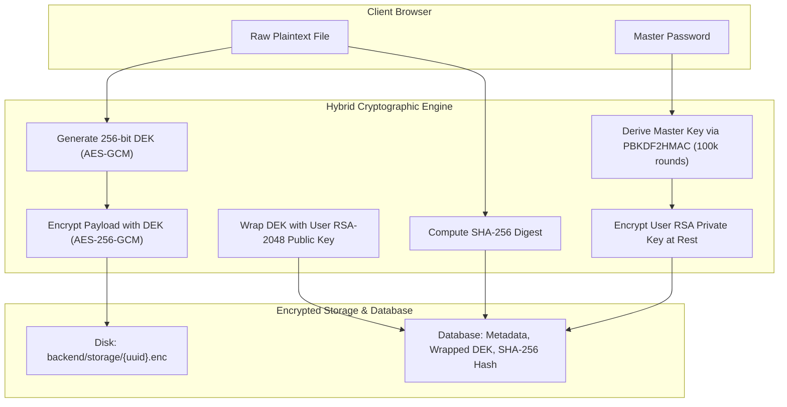

# SecureCloud — Zero-Knowledge Hybrid Cryptographic Cloud Storage & Vault

<div align="center">

[](https://opensource.org/licenses/MIT)
[](https://fastapi.tiangolo.com/)
[](#-cryptographic-architecture)
[](#-cryptographic-architecture)
[](#-cryptographic-architecture)
[](https://vitejs.dev/)
[](https://tailwindcss.com/)
[](https://threejs.org/)

**SecureCloud** is an enterprise-grade, zero-trust cloud storage platform and credential vault engineered with hardware-accelerated hybrid cryptography (**RSA-2048 PKI + AES-256-GCM**), real-time audit telemetry, interactive **Three.js 3D visualizations**, and a modern SaaS interface.

</div>

---

## 📑 Table of Contents
1. [Key Features](#-key-features)
2. [Cryptographic Architecture](#-cryptographic-architecture)
3. [Sensitive Data Protection & Privacy](#-sensitive-data-protection--privacy)
4. [Tech Stack](#-tech-stack)
5. [Interactive 3D Elements](#-interactive-3d-elements)
6. [Getting Started](#-getting-started)
   - [Prerequisites](#prerequisites)
   - [Backend Setup](#backend-setup)
   - [Frontend Setup](#frontend-setup)
   - [Docker Deployment](#docker-deployment)
7. [Running Tests](#-running-tests)
8. [API Endpoints Reference](#-api-endpoints-reference)
9. [Project Structure](#-project-structure)
10. [License & Security Posture](#-license--security-posture)

---

## ✨ Key Features

- **🔒 Zero-Knowledge Hybrid Encryption**:
  - Every file payload is encrypted with a unique, cryptographically random **256-bit symmetric Data Encryption Key (DEK)** via `AES-256-GCM`.
  - The symmetric DEK is wrapped using asymmetric **RSA-2048 Public Key Cryptography** (`OAEP SHA-256`).
- **🛡️ Direct User-to-User PKI Sharing**:
  - Securely share files with other registered accounts. The server unwraps the DEK and re-encrypts it directly with the recipient's RSA public key.
- **🚫 Server-Enforced Access Revocation**:
  - Revoking access immediately updates authorization policies and enforces strict **`403 Forbidden`** barriers on download endpoints.
- **⏱️ Expirable Public Links**:
  - Generate standalone, password-protected download links with time-based expiration (1 hr, 24 hrs, 7 days, 30 days) and dedicated guest views.
- **🔐 Zero-Knowledge Secret Vault**:
  - Isolated credential manager for API keys, SSH keys, passwords, and confidential tokens with master-password client challenge.
- **🌐 Interactive 3D Security Core & Movable Earth**:
  - Three.js WebGL cryptographic core with orbiting encryption rings and mouse-drag interactive 3D Earth Globe physics.
- **⌨️ Command Palette (`Ctrl/Cmd + K`)**:
  - Instant keyboard-driven navigation across files, folders, vault, and security settings.
- **📊 Storage Quota Analytics & Audit Logs**:
  - Live categorical storage usage and cryptographically timestamped security event telemetry with IP tracking.
- **🔍 Cryptographic Integrity Center**:
  - Automated mathematical verification sweeps comparing on-disk ciphertext against immutable **SHA-256 checksums**.

---

## 🔐 Cryptographic Architecture

SecureCloud adopts a **Zero-Trust Hybrid Cryptosystem** model:



### Protocol Specifications
| Component | Primitive / Algorithm | Key Length / Rounds | Purpose |
| :--- | :--- | :--- | :--- |
| **Payload Encryption** | AES-GCM (Galois/Counter Mode) | 256-bit Key, 96-bit IV, 128-bit Tag | Confidentiality & payload authentication |
| **Key Distribution** | RSA OAEP SHA-256 | 2048-bit Keypair | Asymmetric DEK wrapping & multi-user sharing |
| **Key Wrapping at Rest**| PBKDF2HMAC (SHA-256) | 100,000 Iterations | Protect user private key at rest |
| **Integrity Verification**| SHA-256 | 256-bit Digest | End-to-end checksum verification |
| **Session Authorization**| PyJWT (HMAC-SHA256) | 256-bit Signing Secret | Stateless Bearer Token Authorization |

---

## 🛡️ Sensitive Data Protection & Privacy

SecureCloud is engineered from the ground up to prevent data leaks:

1. **Zero Secret Storage**: Raw master passwords and unencrypted private keys are **never** stored in the database or server logs.
2. **Encrypted at Rest**: All file payloads stored on disk in `backend/storage/` are raw encrypted byte streams (`.enc`). If the storage medium is compromised, the data remains unreadable.
3. **Repository Cleanliness**:
   - `.env` files, local database files (`*.db`, `*.sqlite`), and `.enc` storage files are excluded from Git via [.gitignore](file:///.gitignore).
   - `.env.example` contains only configuration placeholders with no embedded production credentials.
4. **Server-Enforced Access**: File downloads always require cryptographic verification of ownership or active, non-revoked share delegation.

---

## 🛠️ Tech Stack

### Backend
- **Framework**: [FastAPI](https://fastapi.tiangolo.com/) (Python 3.13)
- **Database ORM**: [SQLAlchemy 2.0](https://www.sqlalchemy.org/) (Async via `aiosqlite`)
- **Cryptography**: [`cryptography`](https://cryptography.io/) (OpenSSL AESGCM, RSA OAEP, PBKDF2HMAC)
- **Authentication**: [PyJWT](https://pyjwt.readthedocs.io/) & [Passlib](https://passlib.readthedocs.io/) (bcrypt)
- **Testing**: [Pytest](https://docs.pytest.org/) & [AnyIO](https://anyio.readthedocs.io/)

### Frontend
- **Framework**: [React 18](https://react.dev/) + [Vite 5](https://vitejs.dev/)
- **Styling**: [Tailwind CSS v4](https://tailwindcss.com/) + Custom Glassmorphism System
- **3D Graphics**: [Three.js](https://threejs.org/) WebGL Renderers
- **Icons**: [Lucide React](https://lucide.dev/)
- **Typography**: Google Fonts (*Outfit*, *Plus Jakarta Sans*, *JetBrains Mono*)

---

## 🌐 Interactive 3D Elements

1. **3D Security Core ([SecurityCore3D.jsx](file:///frontend/src/components/SecurityCore3D.jsx))**:
   - Floating central shield with physical material lighting.
   - 3 independently rotating cryptographic rings (`AES-256`, `RSA-2048`, `SHA-256`).
   - Dynamic inflow data particles and interactive layer detail inspection modals.
2. **Movable 3D Earth Globe ([CyberCanvas3D.jsx](file:///frontend/src/components/CyberCanvas3D.jsx))**:
   - Procedural continent landmass dot-matrix topology.
   - Click-and-drag rotation with physics inertia and friction deceleration.
   - Pulsing cryptographic security node beacons across global hubs.
3. **3D Vault Lock ([VaultLock3D.jsx](file:///frontend/src/components/VaultLock3D.jsx))**:
   - Mechanical locking animation visualizer for the Zero-Knowledge Vault.

---

## 🚀 Getting Started

### Prerequisites
- **Python**: `3.10` or higher
- **Node.js**: `18.x` or higher
- **npm**: `9.x` or higher

---

### Backend Setup

1. **Navigate to the backend directory**:
   ```bash
   cd backend
   ```

2. **Create and activate a virtual environment**:
   ```bash
   # Windows (PowerShell)
   python -m venv venv
   .\venv\Scripts\Activate.ps1

   # macOS / Linux
   python3 -m venv venv
   source venv/bin/activate
   ```

3. **Install dependencies**:
   ```bash
   pip install -r requirements.txt
   ```

4. **Configure environment variables**:
   ```bash
   cp ../.env.example .env
   ```

5. **Start the FastAPI server**:
   ```bash
   python -m uvicorn backend.main:app --reload --host 127.0.0.1 --port 8000
   ```
   *FastAPI will run at `http://127.0.0.1:8000` with Swagger documentation at `http://127.0.0.1:8000/docs`.*

---

### Frontend Setup

1. **Navigate to the frontend directory**:
   ```bash
   cd frontend
   ```

2. **Install Node dependencies**:
   ```bash
   npm install
   ```

3. **Start the Vite development server**:
   ```bash
   npm run dev
   ```
   *The web application will be accessible at `http://localhost:3000`.*

---

### Default Demo Account
To quickly test all zero-knowledge features, use the default seeded administrator:
- **Email**: `admin@securecloud.io`
- **Password**: `Password123!`

---

### Docker Deployment

To run both backend and frontend containerized via Docker:

```bash
docker-compose up --build
```
- Frontend: `http://localhost:3000`
- Backend API: `http://localhost:8000`

---

## 🧪 Running Tests

Execute the automated integration and end-to-end test suites:

```bash
# Run unit & workflow tests
python -m pytest backend/tests

# Run comprehensive 12-flow end-to-end integration test
python backend/tests/test_end_to_end.py
```

### Verified Test Flows
- `[1/12]` Authentication & Keypair Generation
- `[2/12]` Encrypted File Upload (PDF, ZIP, TXT, Media)
- `[3/12]` File Decryption & SHA-256 Stream Integrity Check
- `[4/12]` Directory Hierarchy & Breadcrumb Navigation
- `[5/12]` User-to-User RSA DEK Sharing
- `[6/12]` Access Revocation (Server-Enforced 403 Forbidden)
- `[7/12]` Expirable Public Links & Passcode Challenge
- `[8/12]` Zero-Knowledge Secret Vault Storage
- `[9/12]` Full-Text Cryptographic Search API
- `[10/12]` Encrypted Trash & Permanent Deletion
- `[11/12]` Storage Quota & Capacity Analytics
- `[12/12]` Security Audit Trail & Event Telemetry

---

## 📡 API Endpoints Reference

| Method | Endpoint | Description |
| :--- | :--- | :--- |
| `POST` | `/api/auth/register` | Register user & generate RSA-2048 PKI keypair |
| `POST` | `/api/auth/login` | Authenticate & issue JWT Bearer token |
| `GET` | `/api/auth/me` | Retrieve authenticated user identity & key metadata |
| `POST` | `/api/files/upload` | Upload & encrypt file with AES-256-GCM |
| `GET` | `/api/files/{id}/download`| Decrypt and stream file payload |
| `GET` | `/api/files/{id}/preview` | Decrypt inline stream for browser preview |
| `GET` | `/api/files/{id}/versions`| Retrieve cryptographic version history |
| `POST` | `/api/shares/user` | Direct user sharing with RSA DEK wrapping |
| `GET` | `/api/shares/shared-with-me` | List inbound shared files |
| `PATCH`| `/api/shares/revoke/{id}` | Revoke sharing access (triggers 403) |
| `POST` | `/api/shares/create` | Create expirable public share link |
| `GET` | `/api/shares/link/{code}` | Retrieve public share link info |
| `GET` | `/api/vault` | List decrypted vault secrets |
| `POST` | `/api/vault` | Store secret with AES-256 payload cipher |
| `DELETE`| `/api/vault/{id}` | Erase secret from vault |
| `GET` | `/api/stats/summary` | Retrieve live storage quota & capacity metrics |
| `GET` | `/api/stats/activity`| Retrieve security audit log telemetry |

---

## 📁 Project Structure

```
cloudstorage/
├── .env.example               # Environment variable configuration template
├── .gitignore                 # Exclusion rules for secrets, DBs, and virtualenvs
├── docker-compose.yml         # Container orchestration configuration
├── README.md                  # Comprehensive platform documentation
│
├── backend/                   # FastAPI Backend
│   ├── auth.py                # JWT creation, verification & user resolution
│   ├── config.py              # Application settings & environment parsing
│   ├── crypto_utils.py        # AES-256-GCM, RSA-2048, PBKDF2HMAC, SHA-256 engine
│   ├── database.py            # Async SQLAlchemy engine & session factory
│   ├── main.py                # FastAPI initialization, CORS & router mounting
│   ├── models.py              # Database models (User, File, Folder, Share, Vault, Log)
│   ├── schemas.py             # Pydantic validation schemas
│   ├── routes/                # Endpoint modular controllers
│   │   ├── auth_routes.py
│   │   ├── file_routes.py
│   │   ├── folder_routes.py
│   │   ├── share_routes.py
│   │   ├── stats_routes.py
│   │   └── vault_routes.py
│   ├── storage/               # Encrypted payload directory (*.enc)
│   └── tests/                 # Integration and end-to-end test suites
│
└── frontend/                  # React + Vite SaaS Client
    ├── src/
    │   ├── App.jsx            # Application shell & modal dispatcher
    │   ├── index.css          # Tailwind CSS & glassmorphic token system
    │   ├── context/           # AuthContext & ToastContext providers
    │   └── components/        # UI & 3D WebGL components
    │       ├── CommandPalette.jsx
    │       ├── CyberCanvas3D.jsx
    │       ├── FileCard.jsx
    │       ├── FileDetailsDrawer.jsx
    │       ├── FileManager.jsx
    │       ├── FileUploadModal.jsx
    │       ├── IntegrityCenter.jsx
    │       ├── Navbar.jsx
    │       ├── OverviewDashboard.jsx
    │       ├── PreviewModal.jsx
    │       ├── PublicShareView.jsx
    │       ├── SecurityCore3D.jsx
    │       ├── SettingsView.jsx
    │       ├── ShareModal.jsx
    │       ├── Sidebar.jsx
    │       ├── StorageStats.jsx
    │       ├── VaultLock3D.jsx
    │       └── VaultView.jsx
    ├── tailwind.config.js     # Tailwind design system configuration
    ├── postcss.config.js      # PostCSS configuration
    └── vite.config.js         # Vite dev server & proxy settings
```

---

## 📜 License & Security Posture

This project is open-sourced under the **MIT License**.

> **Security Advisory**: SecureCloud implements industry-standard cryptography (AES-GCM, RSA OAEP, PBKDF2HMAC). Always ensure that the `JWT_SECRET_KEY` and `MASTER_KEY_SALT` environment variables are kept secret and generated with high entropy in production environments.
